# Linux D01

## Part 1. Installation of the OS
+ Using *cat /etc/issue* to check Ubuntu version.

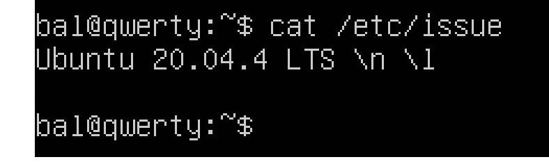

## Part 2. Creating a user
+ Using *sudo useradd -m -s /bin/bash aboba* and *sudo passwd aboba* to make new user and set the password for it. 

+ Using *cat /etc/passwd*
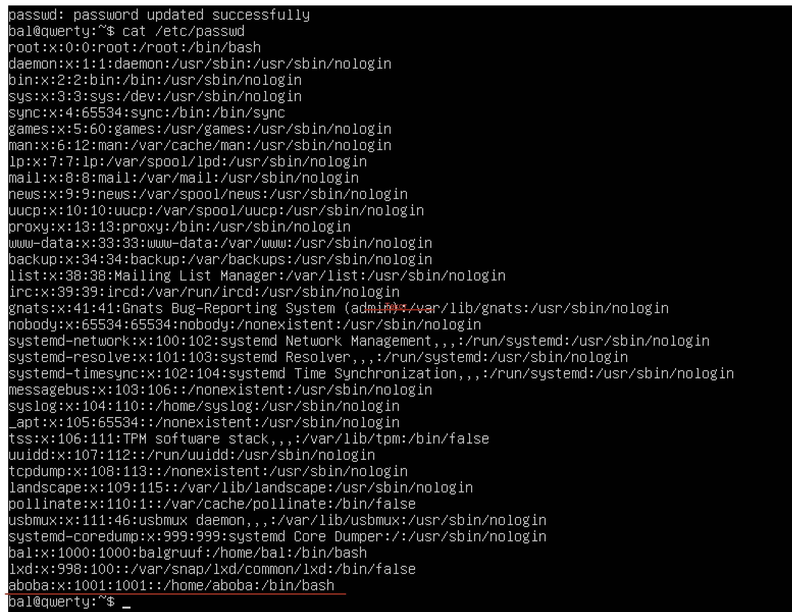    

## Part 3. Setting up the OS network
+ Set machine name as user-1 with *sudo nano /etc/hostname* and *sudo nano /etc/hosts*
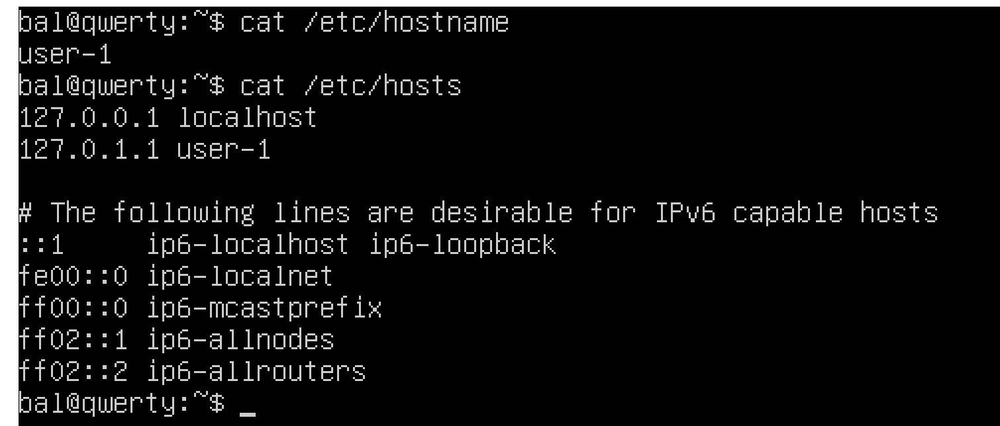   
+ Set the timezone with *sudo timedatectl set-timezone Europe/Moscow*
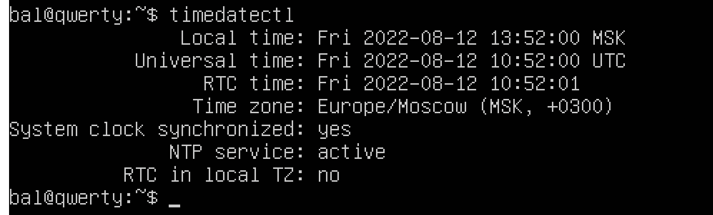  
+ Output the names of the network interfaces using a console command *netstat -i* for ot we have to use *sudo apt install net-tools*
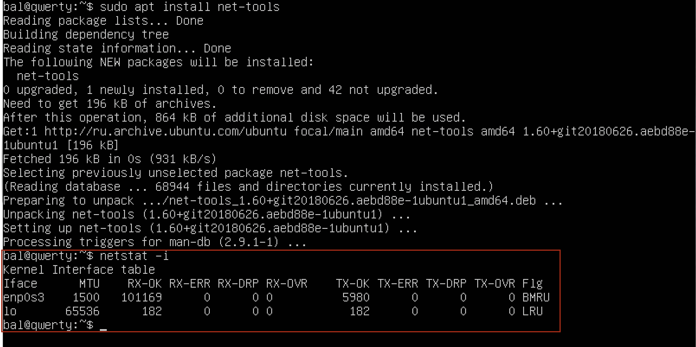 

___The *lo* interface is a loopback interface and allows the computer to access itself. The interface has an IP address of *127.0.0.1* and is necessary for the normal operation of the system. It also has dns-name: *localhost*.___

+ Using console command we can get an IP adress on which DHCP servers work. We need to use: *hostanme -I*
 

___The Dynamic Host Configuration Protocol (DHCP) is a network management protocol used on Internet Protocol (IP) networks for automatically assigning IP addresses and other communication parameters to devices connected to the network using a client–server architecture.___

+ Define and display the external ip address of the gateway (ip) and the internal IP address of the gateway, aka default ip address (gw). Using *curl ifcongig.me/ip* we can get it. *178.207.253*
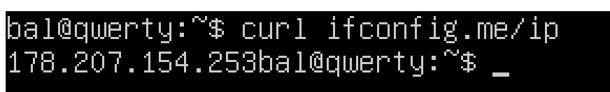 

+ And also get (gw) using *ip route | grep default*
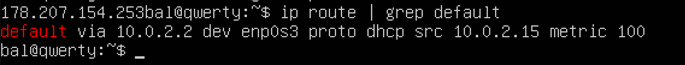 

+ Set static (manually set, not received from DHCP server) ip, gw, dns settings (use public DNS servers, e.g. 1.1.1.1 or 8.8.8.8). 
+ Using *sudo nano /etc/netplan/00-installer-config.yaml* we have to set our own settings for *ip, dns and gw*.
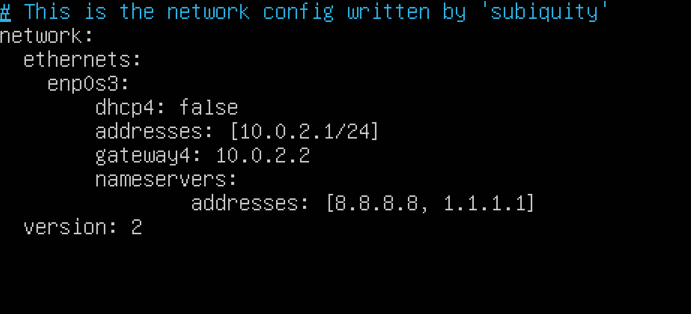 

+ We also have to use *sudo netplane genrate* to save our changes for next using. Then we have to *reboot* our machine. 
+ So now we have to *ping 1.1.1.1* and *ya.ru*
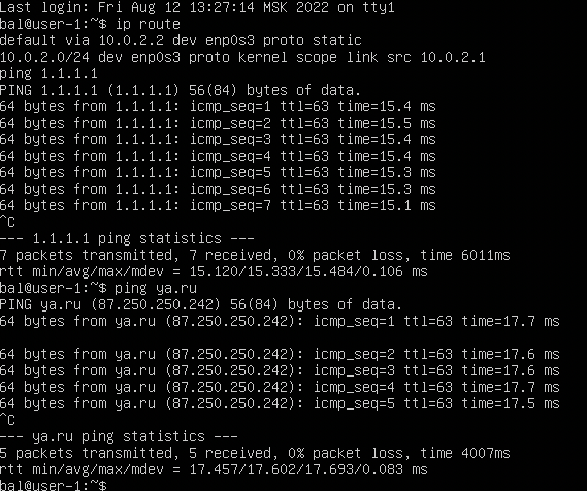 

## Part 4. OS Update

+ Update the system packages to the latest version
Just use *sudo apt upgrade* and say *y* to terminal.
And here we go.
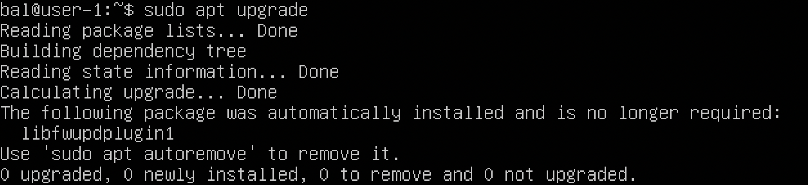 

## Part 5. Using the sudo command
___sudo — allows you to temporarily raise privileges and perform admin tasks. So you don't need to use root for making some tasks.___
+Allow user created in Part 2 to execute sudo command.
I used *sudo usermod -aG sudo aboba* to give *aboba* such opportunity. 

I've reboot VM and changed everything.
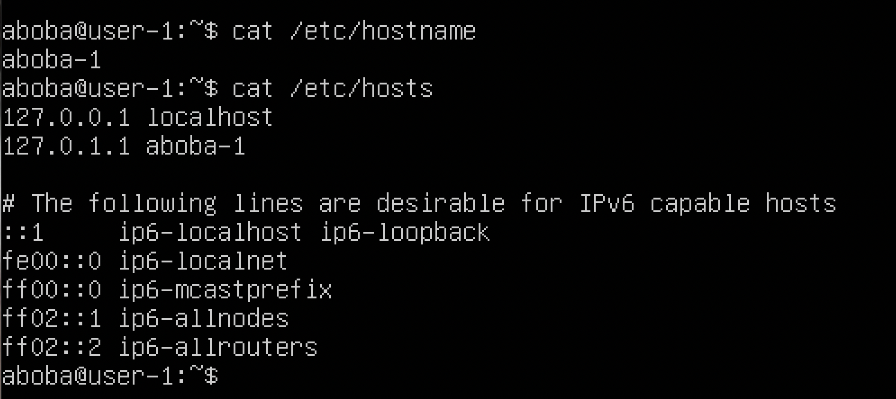

## Part 6. Installing and configuring the time service
+ Set up the automatic time synchronisation service.
    First we need to output the time of the time zone in which you are currently located as task says.
    

    + The output of the following command must contain NTPSynchronized=yes: *timedatectl show*
    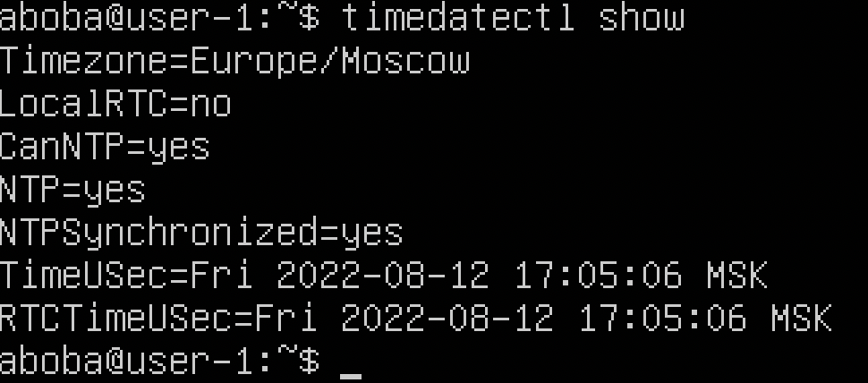

## Part 7. Installing and using text editors
+ Vim:
+ Making file with *touch test_vim.txt*. Opening it with *vim test_vim.txt*. 
+ We have to write our nickname (We need to use I to open insert mode) then we must to use:
*Esc*, *shift + ;* (:), *wq*.
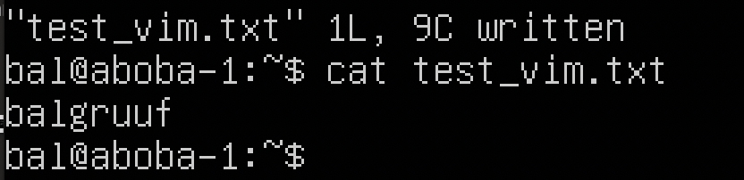

+ Nano
+ Making file with *touch test_nano.txt*. Open it witn *nano test_nano.txt*.
+ Write our nickname. Then *cntrl + X, Y, Enter*.
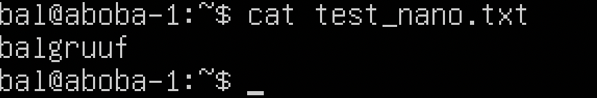

+ Joe 
+ Making file with *touch test_nano.txt*. Open it witn *nano test_nano.txt*.
+ Write our nickname. Then *cntrl + K + X,*.

+ Using each of the three selected editors, open the file for editing, edit the file by replacing the nickname with the "21 School 21" string, close the file without saving the changes.

+ Vim
+ We need to use I to open Insert mode. 
+ Quit without saving: *Esc, shift + ; (:), q!, Enter*
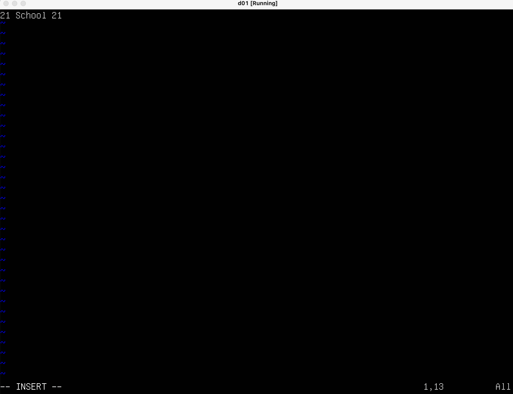

+ Nano
+ Quit without saving: *ctrl + x, N, Enter*

+ Joe 
+ Quit without saving: *ctrl + c, Y*
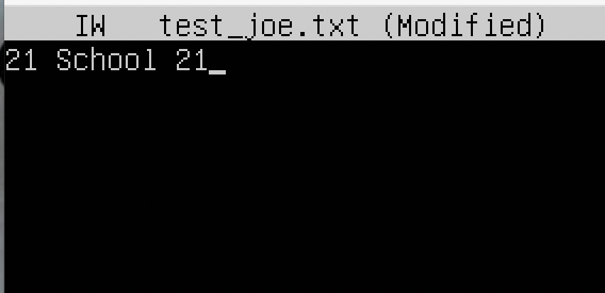

+ Using each of the three selected editors, edit the file again (similar to the previous point) and then master the functions of searching through the contents of a file (a word) and replacing a word with any other one.

+ Vim
+ Finding *Esc + / + Word*
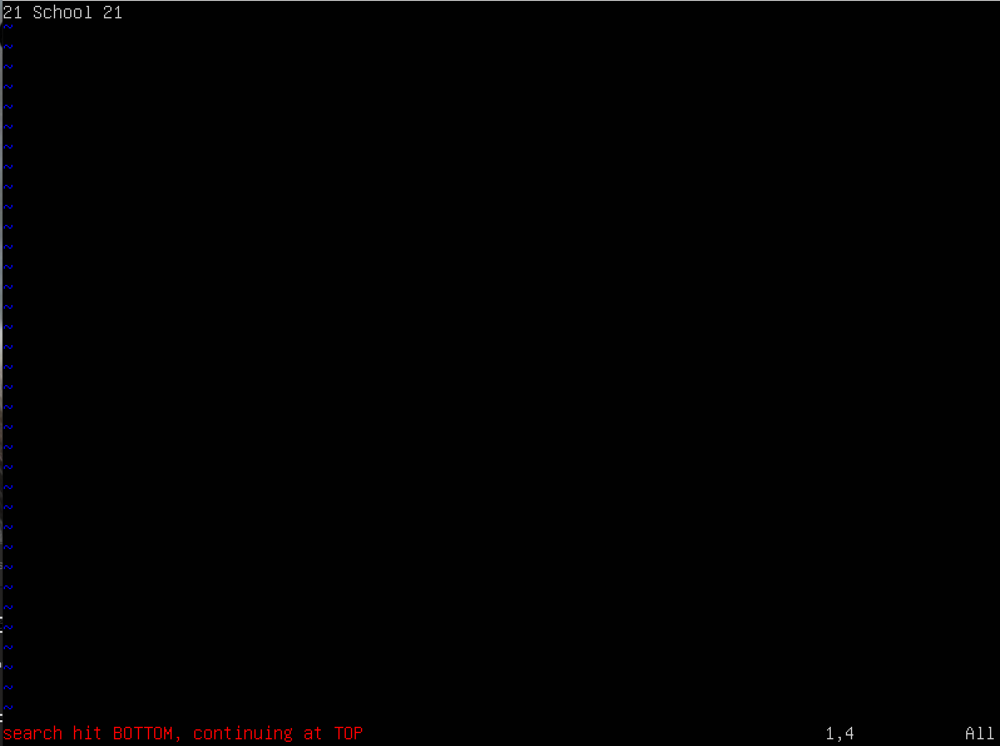

+ Finding and change *Esc :s/word/change_word*

+ Nano
+ Finding *Ctrl + \ *. Write all that you need to find. Then *Enter*, one more time *Enter*. Nano will find you all that was asked. Type *N* to not replace it. 
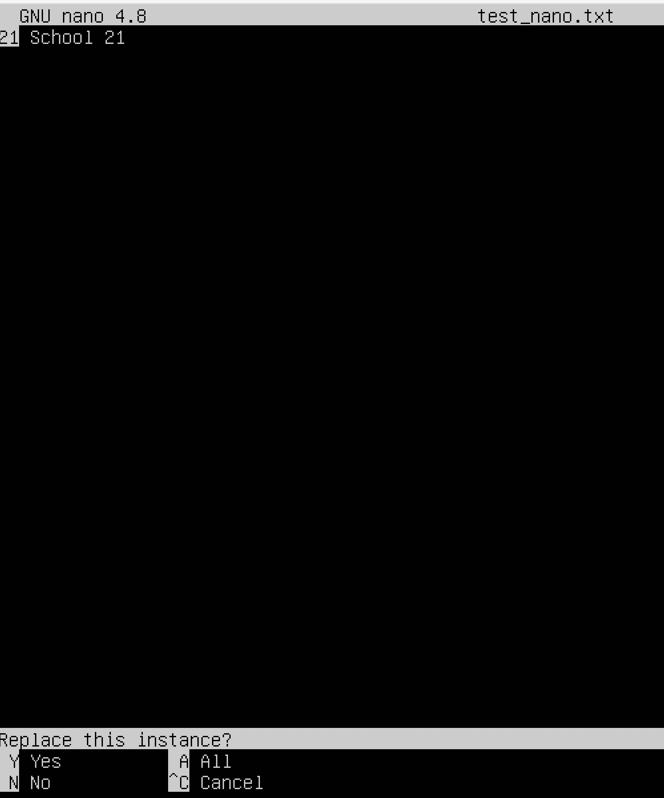

+ Finding and replace are same but you need to type word that you want to use and choose *Y* option. 
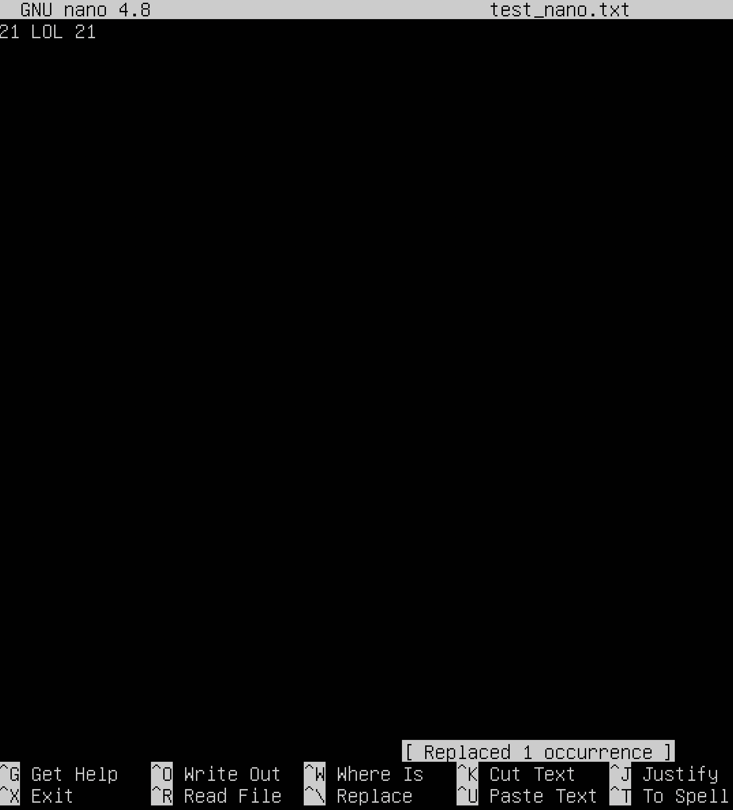

+ Joe
+ Finding in Joe is *ctrl + K + F*. Wirite word then *Enter*. 
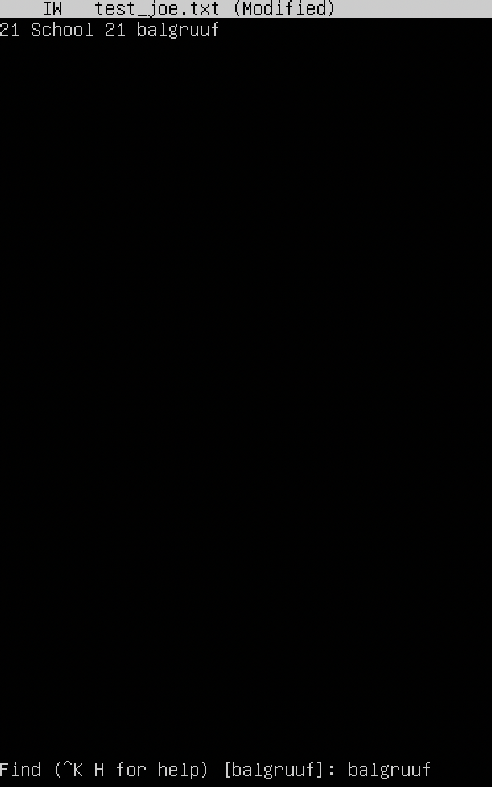
+ Finding and replace *ctrl + k + f. Then word. Then r. Then Enter.*
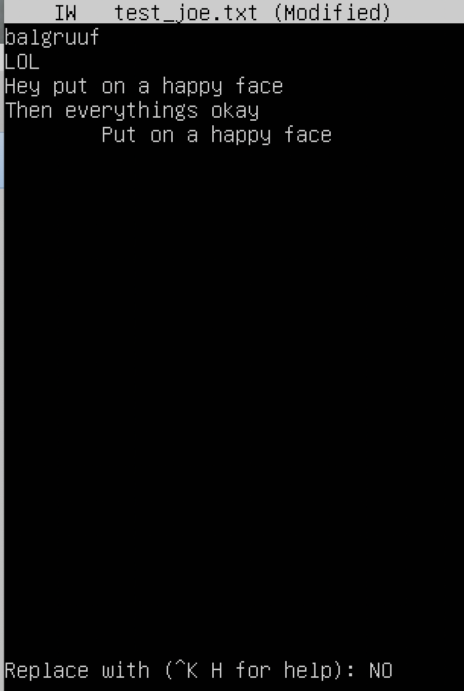

## Part 8. Installing and basic setup of the SSHD service

+ Install the SSHd service. *sudo apt install openssh-server*
+ Add an auto-start of the service whenever the system boots. *sudo systemctl enable ssh*
+ Reset the SSHd service to port 2022. *sudo nano /etc/ssh/sshd_config*. Do it with your arms. Then save. 
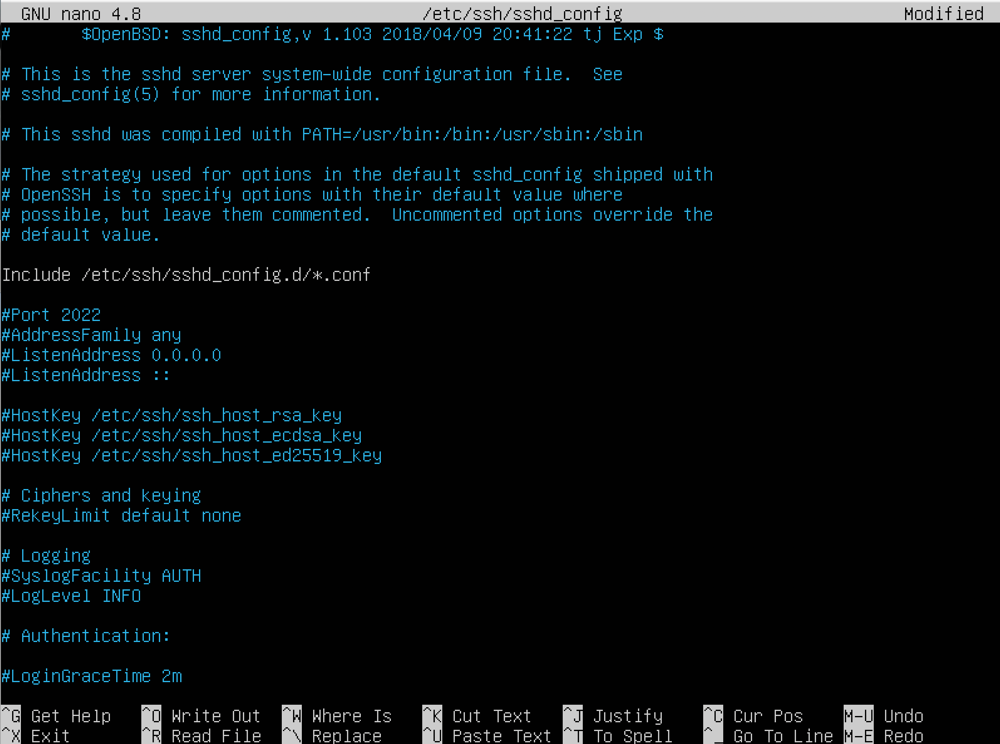

+ Show the presence of the sshd process using the ps command. To do this, you need to match the keys to the command.

___The (ps) utility is one of the simplest and at the same time frequently used programs for viewing the list of processes in Linux. It does not support interactive mode, but it has many options for configuring the output of certain process parameters in Linux.___
*ps options | grep parameter*

*Keys:*
* -A, -e, (a) - select all processes;
* -a - select all processes except background ones;
* -d, (g) - select all processes, even background ones, except session processes;
* -N - select all processes except those specified;
* -C - select processes by command name;
* -G - select processes by group ID;
* -p, (p) - select PID processes;
* --ppid - select processes by PID of parent process;
* -s - select processes by session ID;
* -t, (t) - select processes by tty;
* -u, (U) - select user processes.

*Formatting options:*
* -c - display scheduler information;
* -f - output the maximum available data, for example, the number of threads;
* -F - similar to -f, only outputs even more data;
* -l - long output format;
* -j, (j) - output processes in the Jobs style, minimum information;
* -M, (Z) - add security information;
* -o, (o) - allows you to define your output format;
* --sort, (k) - sort by the specified column;
* -L, (H)- display the process flows in the LWP and NLWP columns;
* -m, (m) - output the flows after the process;
* -V, (V) - output version information;
* -H - display the process tree;

+ Using *ps -ef | grep sshd* print procees of SSHD.
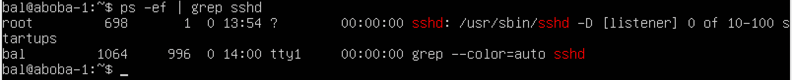

+ Reboot everything.
+ The output of the netstat -tan command should contain 
tcp 0 0.0.0.0:2022 0.0.0.0:* LISTEN 
(if there is no netstat command, it needs to be installed).
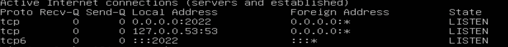

+ Explain the meaning of the -tan keys, the value of each output column, the value 0.0.0.0. in the report.
* The command utility supports parameters that display active or passive sockets using the -t, -n and -a parameters. The flags show RAW, UDP, TCP or UNIX connection connectors. By adding the -a option, the utility will create sockets ready for connection.

## Part 9. Installing and using the top, htop utilities
+ Install and run the top and htop utilities.

+ From the output of the top command determine and write in the report:

- uptime

-  number of authorised users
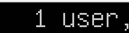

- total system load
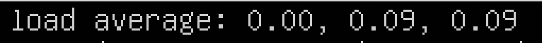

- total number of processes

- cpu load

- memory load

- pid of the process with the highest memory usage and pid of the process taking the most CPU time

+ Add a screenshot of the htop command output to the report:

- sorted by PID, PERCENT_CPU, PERCENT_MEM, TIME
Use *htop -s __*
* PID

* PERCENT_CPU
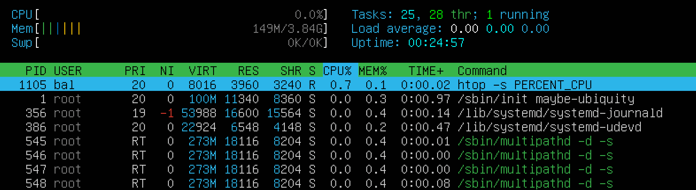

* PERCENT_MEM
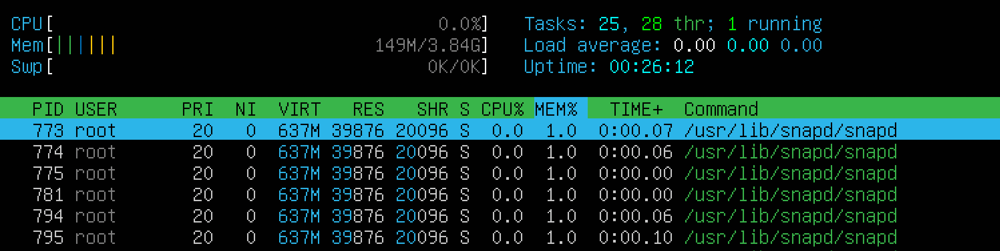

* TIME 
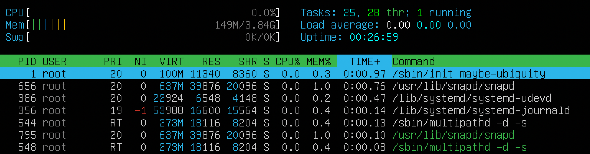

- filtered for sshd process
*Use F4 and type sshd*
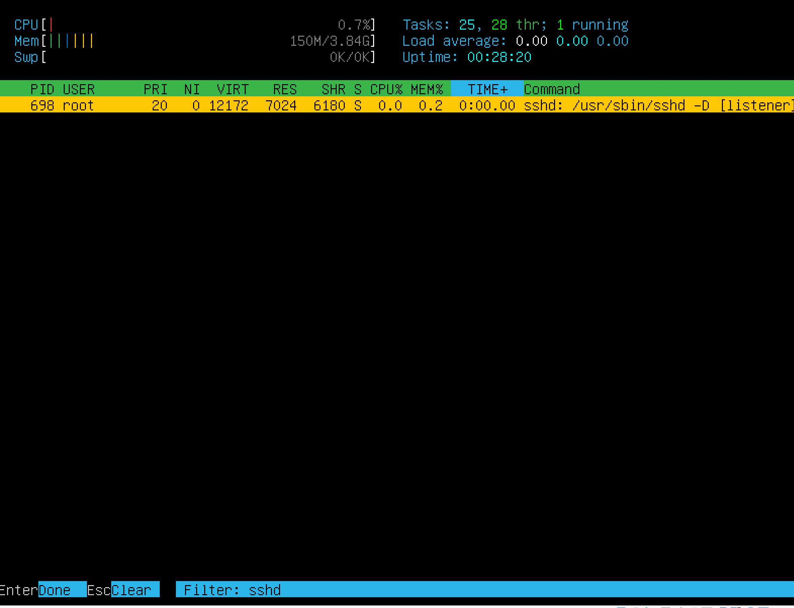

- with the syslog process found by searching
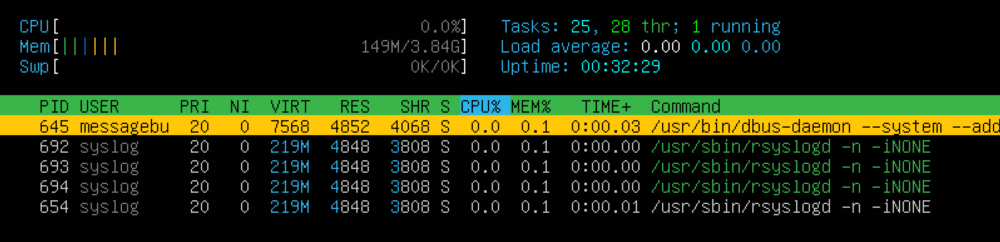

- with hostname, clock and uptime output added
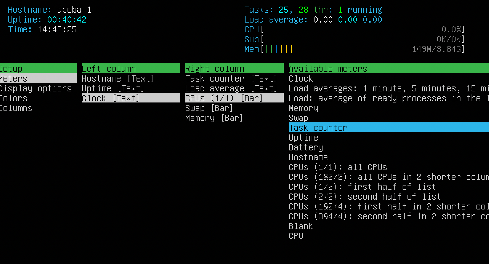

## Part 10. Using the fdisk utility

+ Run the fdisk -l command.
* name of the hard disk: /dev/sda
* capacity 14.67GB
* number of sectors 30740480

## Part 11. Using the df utility
+ Run the df command.

* partition size 10218772 Bytes
* space used 2587160 Bytes
* space free 7090940 Bytes
* percentage used 27%

+ Run the df -Th command.

* partition size 9.8GB
* space used 2.5G
* space free 6.8GB
* percentage used 27%

## Part 12. Using the du utility

+ Run the du command.

Output the size of the /home, /var, /var/log folders.
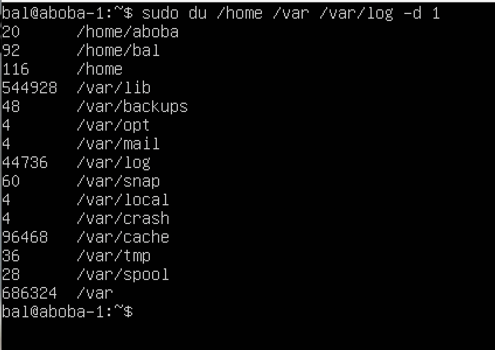
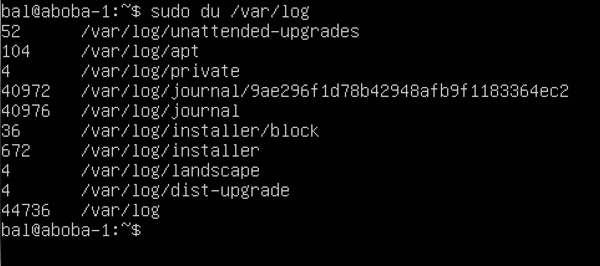

## Part 13. Installing and using the ncdu utility

+ Install the ncdu utility. *sudo apt install ncdu*

* /home
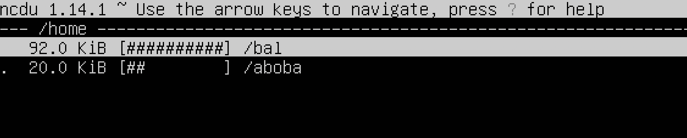

* /var
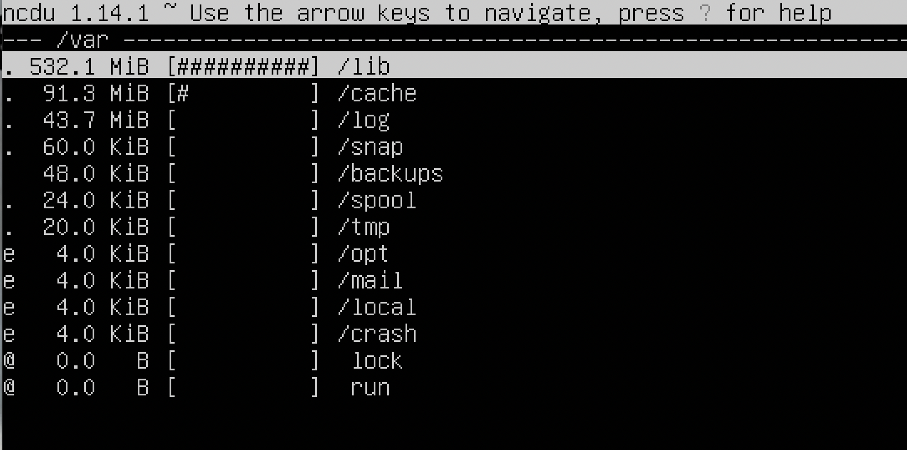

* /var/log
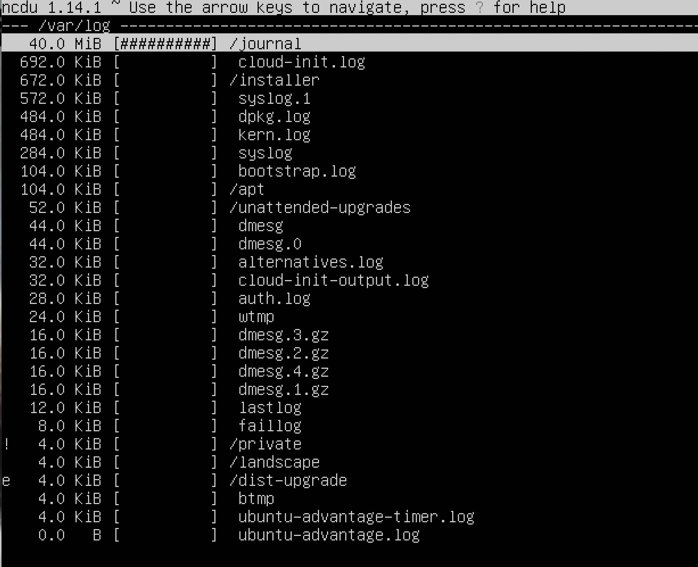

## Part 14. Working with system logs

+ Write the last successful login time, user name and login method in the report.
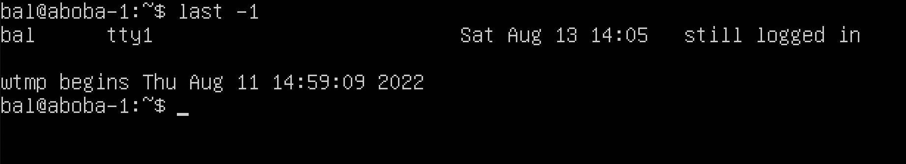
Using lnav.
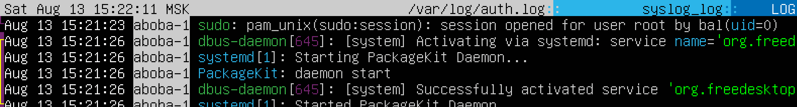

+ Restart SSHd service. *sudo systemctl restart ssh*
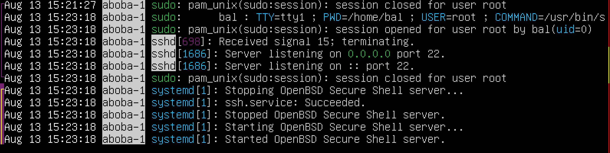

## Part 15. Using the CRON job scheduler 
+ Using the job scheduler, run the uptime command in every 2 minutes.
Use *crontab -e*

+ Find lines in the system logs (at least two within a given time range) about the execution.
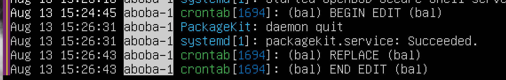

+ Display a list of current jobs for CRON.
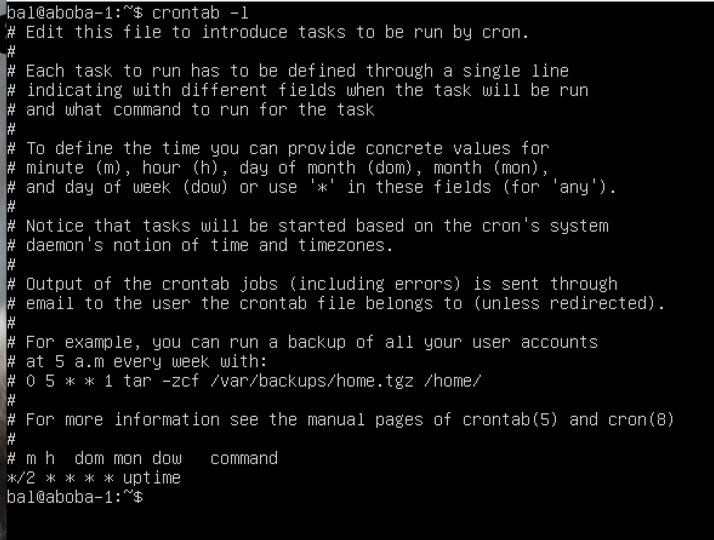

+ Remove all tasks from the job scheduler.
*Use crontab -r*

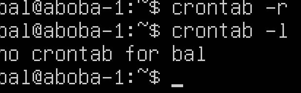

